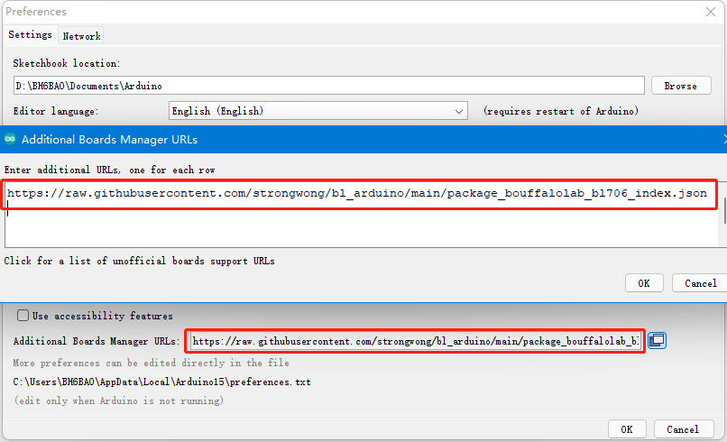
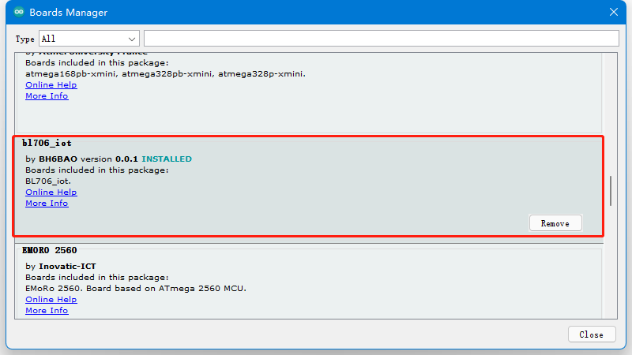

## bl_arduino 

This repo store BouffaloLab bl706_iot board for Arduino deveolpment.

## How use

1. first add the package URL address to the development board manager. "File->Preferences->Additional Boards Manager URLs"

```
https://raw.githubusercontent.com/strongwong/bl_arduino/main/package_bouffalolab_bl706_index.json
```



2. Install bl706_iot in the development board manager. "Tools->Board->Boards Manager";Find it in the Boards Manager and install it.



3. Write code to run in Arduino

```c
void gpio_blink_init(void)
{
    gpio_set_mode(GPIO_PIN_22, GPIO_OUTPUT_PP_MODE);
    gpio_set_mode(GPIO_PIN_29, GPIO_OUTPUT_PP_MODE);
    gpio_set_mode(GPIO_PIN_30, GPIO_OUTPUT_PP_MODE);
    gpio_set_mode(GPIO_PIN_31, GPIO_OUTPUT_PP_MODE);

    gpio_write(GPIO_PIN_22, 0);
    gpio_write(GPIO_PIN_29, 0);
    gpio_write(GPIO_PIN_30, 0);
    gpio_write(GPIO_PIN_31, 0);
}

void led_running(void)
{
    gpio_write(GPIO_PIN_22, 1);
    bflb_platform_delay_ms(500);
    gpio_write(GPIO_PIN_22, 0);

    gpio_write(GPIO_PIN_29, 1);
    bflb_platform_delay_ms(500);
    gpio_write(GPIO_PIN_29, 0);

    gpio_write(GPIO_PIN_30, 1);
    bflb_platform_delay_ms(500);
    gpio_write(GPIO_PIN_30, 0);

    gpio_write(GPIO_PIN_31, 1);
    bflb_platform_delay_ms(500);
    gpio_write(GPIO_PIN_31, 0);
    
}
void setup() {
  // put your setup code here, to run once:
gpio_blink_init();
}

void loop() {
  // put your main code here, to run repeatedly:
led_running();
}
```

Other steps are the same as when using other arduino development boards.

## bl702_core 

https://github.com/strongwong/bouffalo_arduino_lib

## Other

Although it can be compiled and run under Arduino now, the code library is not fully compatible with the Arduino style, and there are still a lot of improvements to be made, so we welcome interested parties to improve it. Source code: https://github.com/strongwong/bouffalo_arduino_lib
